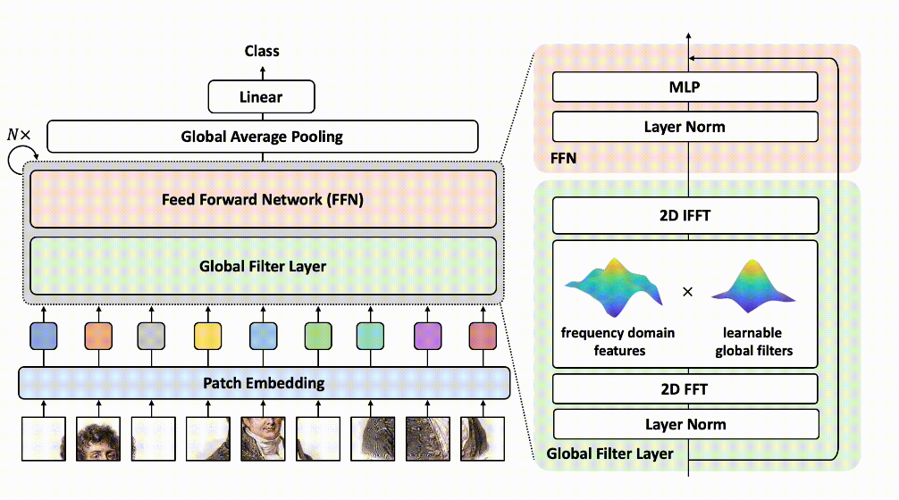

# GFNet Vision Transformer for Alzheimer's disease Classification of the ADNI Brain dataset through pytorch

## Abstract

Alzheimer's disease is a progressive neurodegenerative disease that destroys memory and many other important mental functions. Alzheimer's effects millions of people globally with early detection being a critical step for providing proper treatment to patients. This project's aim is to address the problem of classifying Alzheimer’s Disease (AD) from brain scans using the ADNI dataset. The dataset includes brain MRI images of patients with AD and healthy controls. having an accurate classification model for Alzheimer's disease will significantly help researchers and doctors to pregress in teh efforts of detect AD at a fast and early rate.

## GFNet

### Why use GFNet here?

Image found from reference [2]
## ADNI dataset
put example image of data here

explain access

## Pre-processing the Data

what you did to the data from pure form

## Model Design

## Usage

    1. Downloading the data structure:

    2. Clone the repository:

    3. Training:

    4. Predictions:

### Requirements

## Results

Figures ect
accuracy

## References

[1] National Institute of Aging. (2023, April 5). Alzheimer’s Disease Fact Sheet. National Institute on Aging.  https://www.nia.nih.gov/health/alzheimers-and-dementia/alzheimers-disease-fact-sheet

[2] Shengjie, Z., Xiang, C., Bohan, R., & Haibo, Y. (2022, August 29). 
3D Global Fourier Network for Alzheimer’s Disease Diagnosis using Structural MRI. MICCAI 2022
Accepted Papers and Reviews. https://conferences.miccai.org/2022/papers/002-Paper1233.html

[3] Rao, Y., & Zhao, W. (2021). Global Filter Networks for Image Classification. GitHub.
https://github.com/raoyongming/GFNet/tree/master

‌