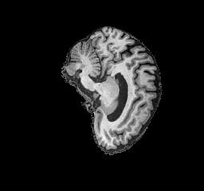
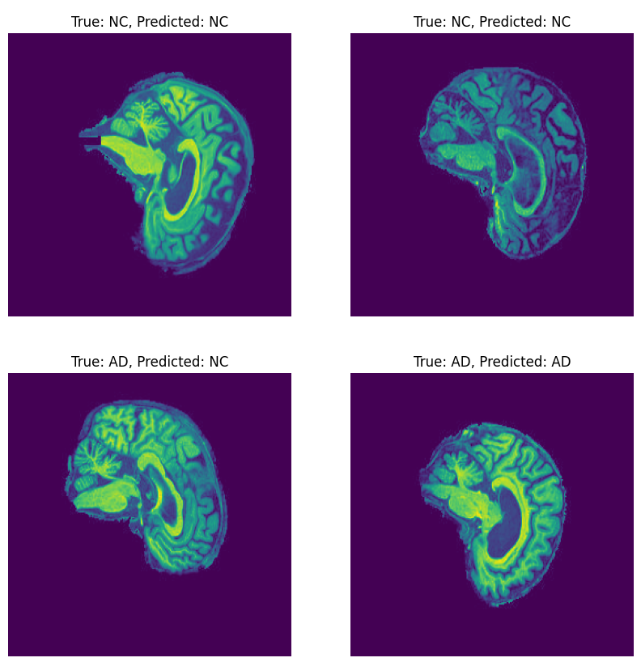
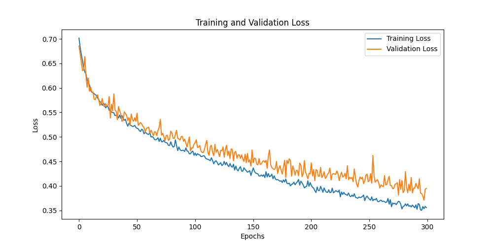
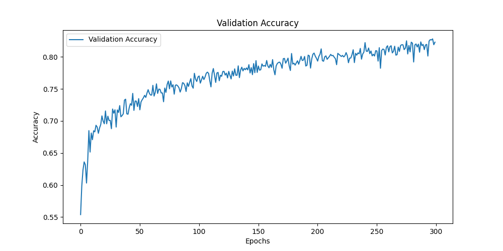
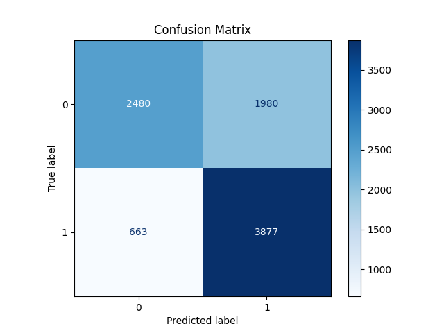

# GFNet Vision Transformer for Alzheimer's Classification of the ADNI Brain dataset


This repository contains the code of a pytorch implementation of a custom Global Filter Network (GFnet) based on identifying Alzheimer's disease from 2D MRI scans of the brain. Alzheimer's disease is a progressive neurodegenerative disease that destroys memory and many other important mental functions. Early detection of Alzheimer's is a critical step for providing proper treatment to patients. This project aims to address the problem of fast classification of Alzheimer’s Disease from brain scans using the Alzheimer’s Disease Neuroimaging Initiative(ADNI) dataset. The dataset contains a number of sliced MRI brain scan images separated into Cognitive Normal (NC) and Alzheimer's disease(AD) images. This model is built upon from the original GFnet design "Global Filter Networks for Image Classification" [3].


## The Model Architecture
The GFnet is a deep learning architecture originally designed for image classification created by Tsinghua University from their release of "Global Filter Networks for Image Classification" [3]. The GFNet has a transformer-style architecture that replaces the self-attention layer in vision transformers(ViTs) with three main components: 

-   A 2D discrete Fourier transform
-   An element-wise multiplication between frequency-domain features and the learnable global filters
-   A 2D inverse Fourier transform

This design was to address the issue of complexity, as the complexity of self-attention and the MLP grows quadratically as an image size increases which results in a model that is hard to scale up for problems(Tsang, 2023). The GFNet's approach is to learn long-term spatial dependencies in the frequency domain with log-linear complexity.

The Model design follows closely to the original implementation shown below:


_Image Reference: [Rao, Y., & Zhao, W. (2021). Global Filter Networks for Image Classification. GitHub.](https://github.com/raoyongming/GFNet/tree/master)_


### Why Use GFNet?
The GFNet is designed for image classification and has performed significantly well on the large visual database ImageNet. For the ADNI dataset, the task is very similar, to learn the underlying data structures of the images and to classify whether a given image has Alzheimer's or not. A major benefit of the GFNet compared to other deep learning options is its scalability which is no doubt an important aspect in the medical research industry. For this problem space, we want a fast and accurate solution with the ability of the model to expand to more complex data in the future. 


## About the Dataset
The ADNI dataset has been used in this project to train and test our model. ADNI is a well-known Alzheimer's disease research dataset that includes thousands of Magnetic Resonance Imaging (MRI) brain scans. The data has been separated into two groups; Normal Control (NC), which are brain images of healthy individuals, and Alzheimer's Disease (AD), which are individuals who have been diagnosed with Alzheimer's disease.

 The ADNI dataset can be downloaded from their website, [ADNI website](https://adni.loni.usc.edu/).

 Here is an example image from the data set:

 

### Pre-processing the Data
The images get pre-processed prior to training and testing. This step is completed in the training stage when running train.py which calls dataset.py to process the data. Note: The model assumes there is a training and testing split already in the data directory, this will be explained under the "Usage" heading. The preprocessing for the training and testing data includes:

 - Splitting the training set to 20% validation, 80% training. This is to help evacuate the models' performance.
 - Resizing the images to 256 x 256 pixels to ensure constancy across all images.
 - Setting the Images to greyscale to ensure all images are consistent and to reduce computation time. minimal information loss would occur as the images are already presented in a grey-scale fashion.
 - Normalizing the images to a mean of 0.1156 and a standard deviation of 0.2202. This was calculated in [utils.py](utils.py) the file by iterating through the training images and averaging their means and standard deviations. This was to help during training.

 **Other preprocessing applied to only the training dataset**:

 - Random augmentation, random cropping and random horizontal flips. This was to improve the generalized performance of the model.
 

## Usage

### Requirements

- Python 3.x
- matplotlib==3.8.4
- numpy==2.1.2
- Pillow==11.0.0
- scikit_learn==1.4.2
- timm==1.0.11
- torch==2.2.2+cu121
- torchvision==0.17.2


This Model was trained and tested on the UQ High-performance computer Rangpur. Running locally will likely result in different run times and possibly slightly different results.

### Dataset Structure
This model is assumed to be ran on the UQ Rangpur HPC with the dataset directory location: 
**'/home/groups/comp3710/ADNI/AD_NC'**
If this directory location does not work for you, this can be changed in [dataset.py](dataset.py)

The ADNI dataset structure will require to have the following:

```
 AD_NC/
    ├── test/
    │   ├── AD/
    │   └── NC/
    ├── train/
        ├── AD/
        └── NC/
```


### Training

To train the GFNet on the ADNI dataset from scratch, run the following:
```
python train.py
```
This will save the trained final model to your source directory as 'trained_model.pth'.


### Predictions

To create predictions from the model, run the following: 

```
python predict.py --model_path /path/to/trained_model.pth --output-dir /path/to/image_dir
```

-  **--model_path** is to the 'trained_model.pth' file.
-  **--output-dir** is where you want to store your predictions

If no arguments are parsed, the model will assume that 'trained_model.pth' is in your source directory and the predicted images will create and save the images in a directory called 'prediction_outputs' in the source directory.

The predicted images are 4 randomly selected images from the testing directory. 

Here is an example output:




## Results

This GFNet model had reached a final accuracy of % 70.63 and a test loss of 1.2090 on the ADNI test dataset. This accuracy was reached after training the model over 300 Epochs which took a total of 10.9 hours on the UQ Rangpur HPC.

Below are two graphs showing the training and validation loss over the 300 epochs, as well as the validation accuracy.

 

We can see that the validation loss follows quite closely to the training, only lagging by approximately 0.05 at the end of training. The graphs show a fast decrease in the first 50 epochs than followed by a more gradual decrease. further training of the model could have been conducted, 
however, during the development of the model, the model showed signs of overfitting and no increase in accuracy was made.

Below is the resulting confusion matrix of the testing data:



The model design used here on the ADNI dataset was chosen following the base of the original GFNet design as well as through trialling a variety of different hyperparameters which resulted in the most success.


```
        img_size=256,
        patch_size= 16,
        embed_dim=512,
        num_classes=2,
        in_channels=1,
        drop_rate=0.5,
        depth=19,
        mlp_ratio=4.,
        drop_path_rate=0.25,
        norm_layer=partial(nn.LayerNorm, eps=1e-6)
```

The results do show a relatively high success rate of correct predictions of Alzheimer's disease, however, there is still room for improvement. Further
testing  of the GFnet with a greater depth and/or number of embedded dimensions may yield a higher test accuracy, however, this will likely increase the training time significantly. Variants of the GFnet may also work well on ADNI, such as the CNN-style hierarchical models which may capture the underlying data structure better.


## References

[1] National Institute of Aging. (2023, April 5). Alzheimer’s Disease Fact Sheet. National Institute on Aging.  https://www.nia.nih.gov/health/alzheimers-and-dementia/alzheimers-disease-fact-sheet

[2] Shengjie, Z., Xiang, C., Bohan, R., & Haibo, Y. (2022, August 29). 
3D Global Fourier Network for Alzheimer’s Disease Diagnosis using Structural MRI. MICCAI 2022
Accepted Papers and Reviews. https://conferences.miccai.org/2022/papers/002-Paper1233.html

[3] Rao, Y., & Zhao, W. (2021). Global Filter Networks for Image Classification. GitHub.
https://github.com/raoyongming/GFNet/tree/master

[4] Alzheimer’s Disease Neuroimaging Initiative. (2024). ADNI. https://adni.loni.usc.edu/

[5] Tsang, S.-H. (2023, January 8). Review — GFNet: Global Filter Networks for Image Classification. Medium. https://sh-tsang.medium.com/review-gfnet-global-filter-networks-for-image-classification-6c35c426ab51

